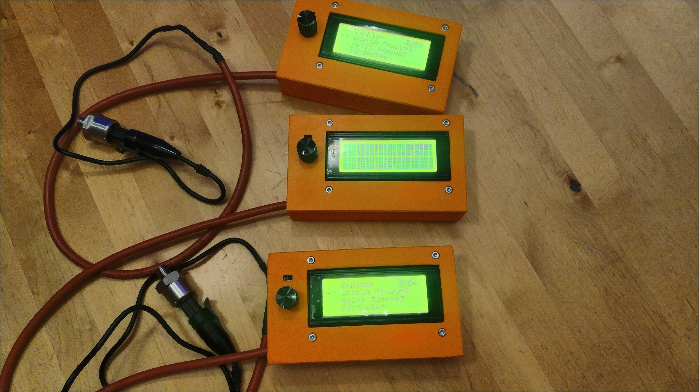
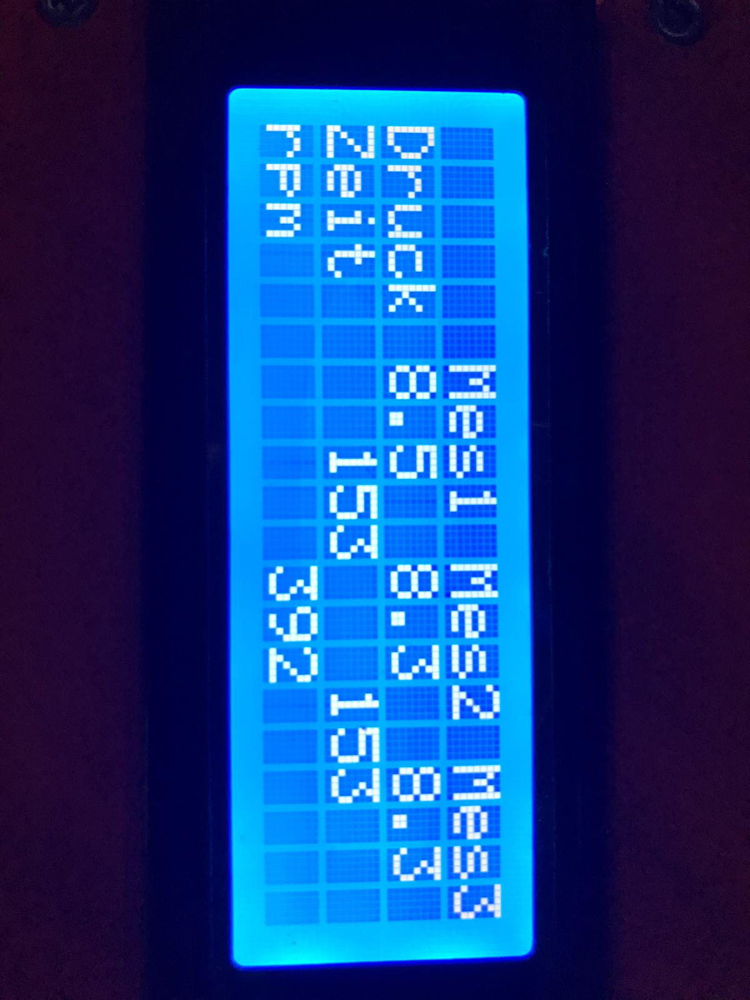

# Wankler – Kompressionsmessgerät für Wankelmotoren

Der **Wankler** ist ein mikrocontrollergesteuertes Kompressionsmessgerät für Wankelmotoren. Er misst den Kompressionsdruck aller drei Brennkammern sowie die Motordrehzahl und zeigt beides direkt auf einem LCD-Display an.

## Funktionsweise

Der Mikrocontroller liest das Signal eines Drucksensors mit **1000 Hz** ein. Die Messwerte werden per gleitendem Mittelwert geglättet (die Filterkonstante lässt sich über das Display einstellen). Anschließend wird der sinusförmige Druckverlauf des Wankelmotors analysiert und Minima/Maxima ermittelt: Drei aufeinanderfolgende Maxima entsprechen den Kompressionswerten der drei Brennkammern.

Gleichzeitig wird die zeitliche Differenz zwischen den Maxima gemessen, woraus sich die Motordrehzahl ergibt – ein wichtiger Wert, da der zu erwartende Kompressionsdruck direkt von der Drehzahl abhängt.

## Projektstruktur

| Ordner | Inhalt |
|---|---|
| [`firmware/`](firmware/) | Arduino-Firmware (PlatformIO) + fertig kompilierte `.hex`-Datei |
| [`hardware/`](hardware/) | Schaltplan, Stückliste (BOM) und EasyEDA-Projekt der optionalen Interfaceplatine |
| [`3d-print/`](3d-print/) | Gehäuse als druckfertige `.3mf`- und editierbare `.step`-Datei |
| [`docs/`](docs/) | Baufotos als Montage-Referenz |

## Aufbau eines eigenen Messgeräts

1. **Gehäuse drucken** – siehe [`3d-print/`](3d-print/). `Case.3mf` direkt in den Slicer laden und drucken, `Wankler_v24.step` bei Bedarf im CAD anpassen.
2. **Elektronik besorgen** – Bauteilliste in [`hardware/BOM.xlsx`](hardware/BOM.xlsx), inkl. typischer eBay-Suchbegriffe.
3. **Platine (optional) fertigen lassen** – EasyEDA-Projekt in [`hardware/easyeda/`](hardware/easyeda/) direkt bei JLCPCB bestellbar. Die Platine ist **nicht zwingend nötig**, dient nur der einfacheren Montage. Die ersten Geräte wurden komplett diskret verdrahtet.
4. **Firmware flashen** – entweder die fertige [`firmware/firmware.hex`](firmware/firmware.hex) mit einem Tool wie [XLoader](http://www.hobbytronics.co.uk/download/XLoader.zip) auf den Arduino Nano spielen, oder den Quellcode in [`firmware/src/main.cpp`](firmware/src/main.cpp) mit PlatformIO selbst bauen. Details in [`firmware/README.md`](firmware/README.md).
5. **Zusammenbauen** – eine geschriebene Anleitung gibt es aktuell noch nicht, aber eine bebilderte Referenz aus dem eigenen Bauprozess in [`docs/assembly.md`](docs/assembly.md).

## Sensor-Kalibrierung

Mehrere der verwendeten (chinesischen) Drucksensoren wurden in einem Prüflabor mit hochwertigem Referenz-Messequipment verglichen. Mit der in der Firmware hinterlegten Kalibrierung lag die Abweichung durchweg unter 0,1 bar – daher wurde auf eine nutzerseitige Kalibrierung über das Display verzichtet.

## Platine gefällig?

Wer eine fertig bestückte Interfaceplatine möchte statt selbst zu bestellen: einfach beim Projektautor melden, es liegen noch ein paar Exemplare bereit.

## Mitmachen

Eine schriftliche Montageanleitung fehlt bislang – wer sich zutraut, eine zu schreiben, ist herzlich zu einem Pull Request eingeladen. Auch sonstige Verbesserungen an Firmware, Platine oder Gehäuse sind willkommen.

## Lizenz

Dieses Projekt (Firmware, Hardware-Design und Gehäuse-Konstruktion) steht unter der [MIT-Lizenz](LICENSE).
