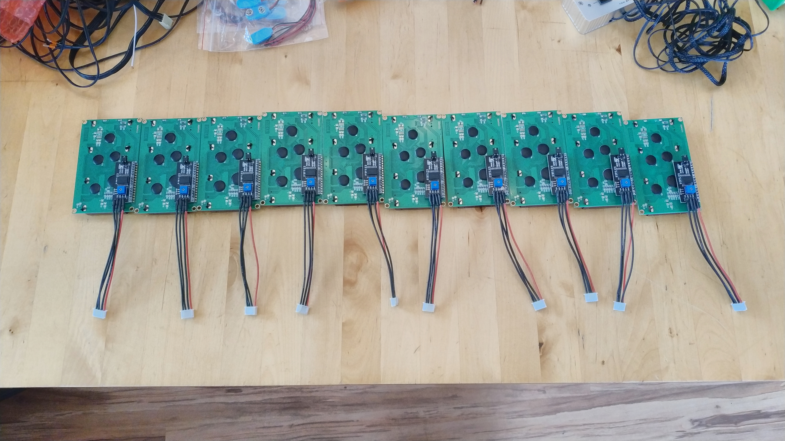
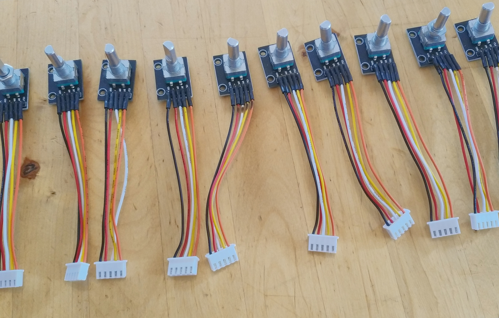
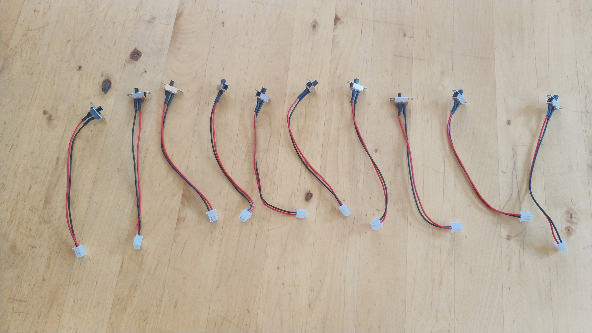
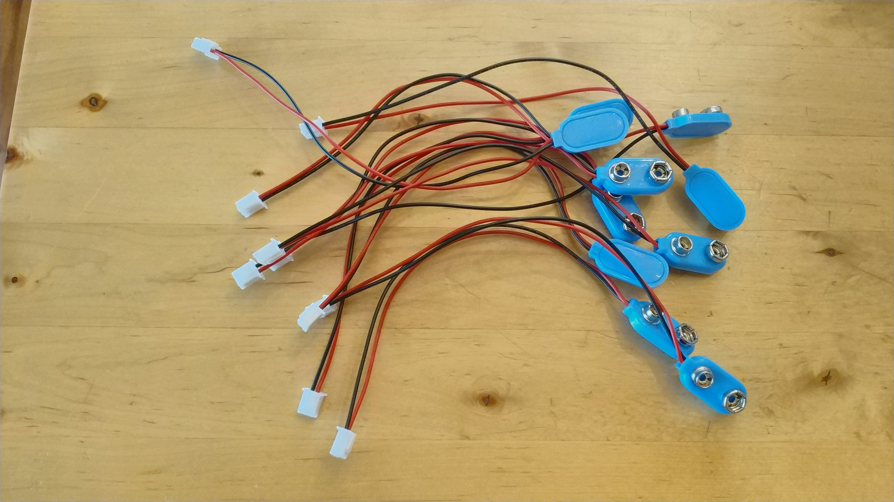
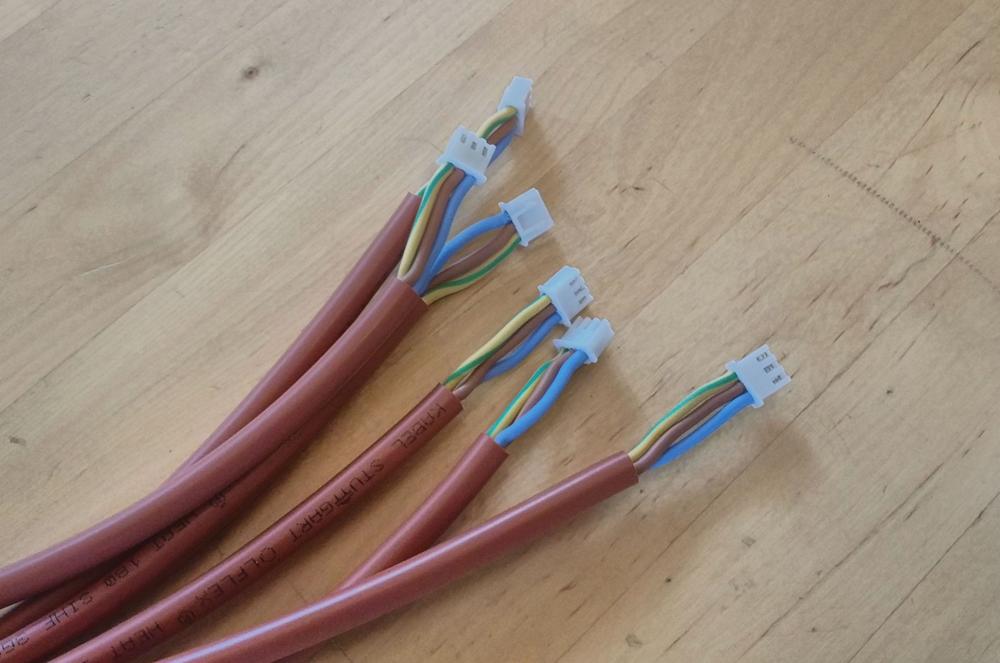
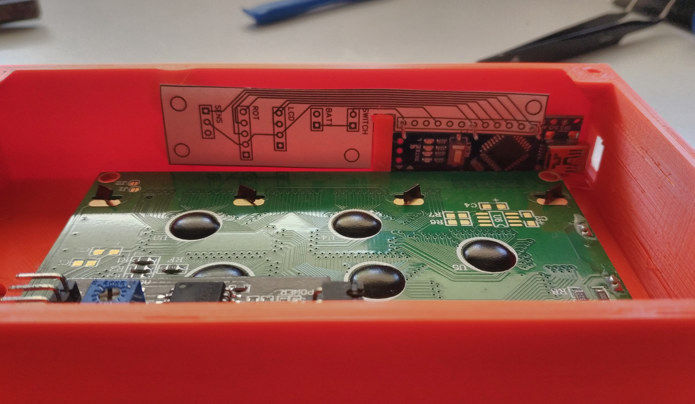
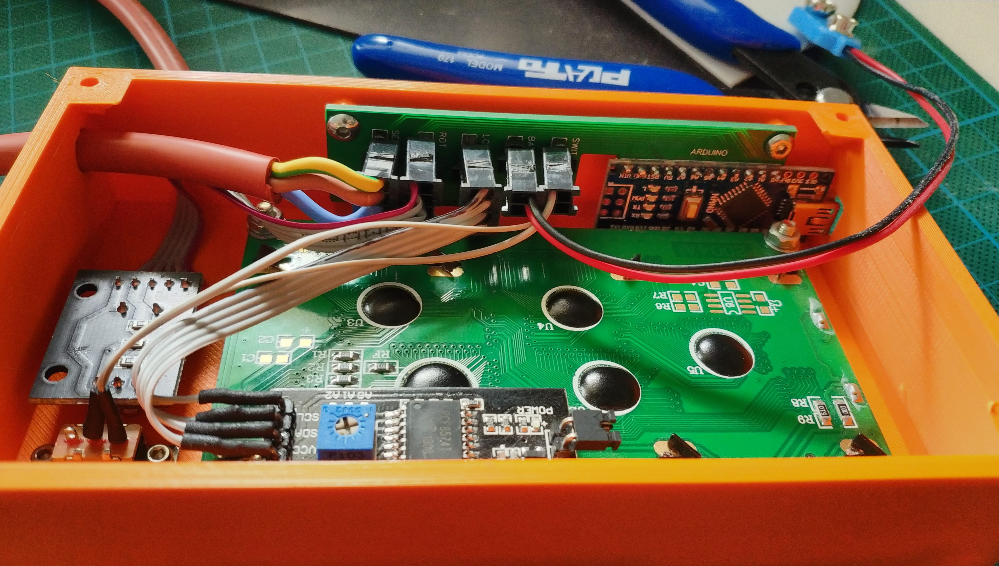
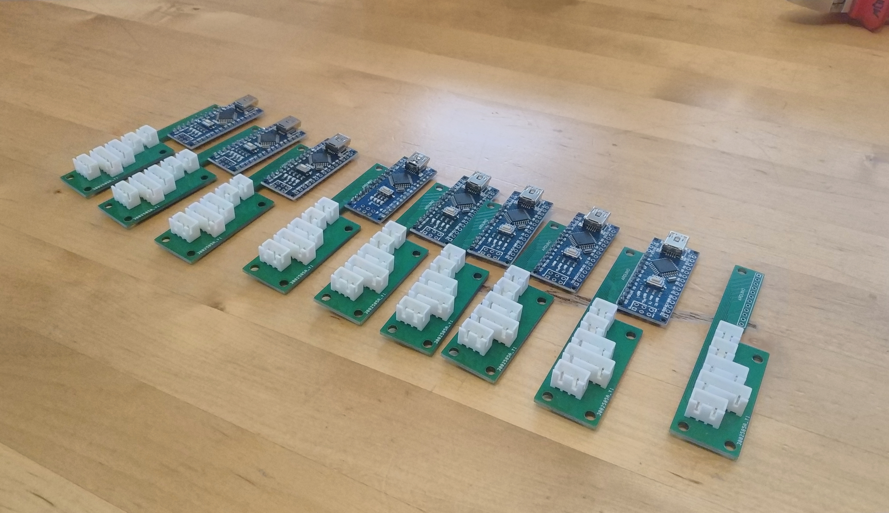
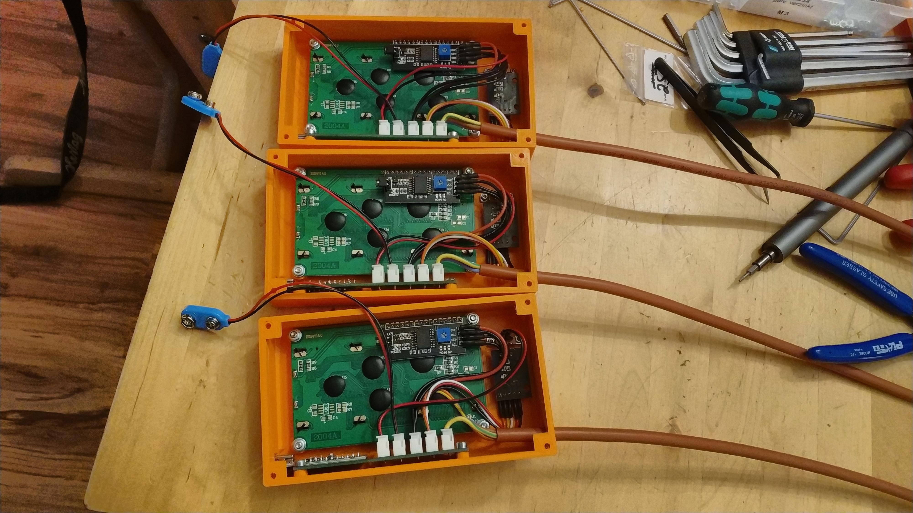
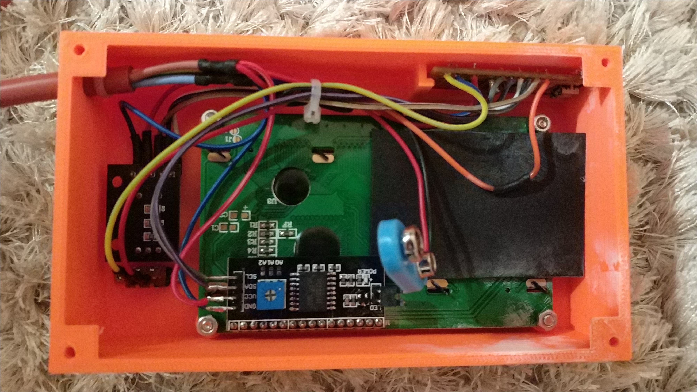

# Montage – Bildreferenz

> Eine geschriebene Schritt-für-Schritt-Anleitung gibt es aktuell noch nicht. Als Orientierung dient stattdessen diese Bildergalerie aus dem Bauprozess mehrerer Messgeräte. Wer eine schriftliche Anleitung beisteuern möchte: sehr gerne per Pull Request!

## 1. Kabel & Stecker vorbereiten

Alle Komponenten werden mit passenden Steckverbindern konfektioniert, damit sich das Gerät ohne Löten am Gehäuse zusammenstecken lässt.

| | |
|---|---|
|  |  |
| LCD-Displays mit JST-Steckern | Drehencoder mit JST-Stecker |
|  |  |
| Ein-/Ausschalter mit Stecker | 9V-Batterieclips mit Stecker |
|  | |
| JST-Stecker an der Sensorleitung (Drucksensor) | |

## 2. Interfaceplatine bestücken & testen

Die optionale Interfaceplatine vereinfacht die Verkabelung erheblich. Vor der Serienfertigung wurde der Aufbau erst mit einer Papierschablone, dann mit realen Steckern getestet.

| | |
|---|---|
|  |  |
| Erster Test: Steckerbelegung auf Papier geprüft | Dritter Test: von Molex- auf JST-Stecker gewechselt |
|  | |
| Mehrere fertig bestückte Interfaceplatinen | |

## 3. Endmontage im Gehäuse

Zwei Varianten sind entstanden: mit Interfaceplatine (empfohlen, einfacher) und komplett diskret verdrahtet (die ersten gebauten Geräte).

| | |
|---|---|
|  |  |
| Mit Interfaceplatine montiert | Ohne Platine, diskret verdrahtet |

## 4. Fertige Geräte

| | |
|---|---|
|  |  |
| Mehrere fertige Messgeräte, angeschlossen an den Drucksensor | LCD-Anzeige nach einer Messung (Druck, Zeit, Drehzahl) |
